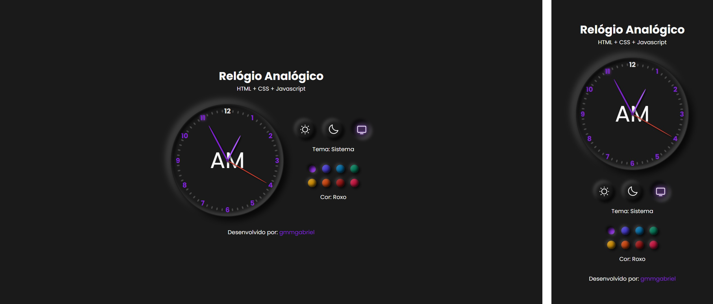

# Relógio Analógio

---

Construído com HTML, CSS e Javascript.

## Funcionalidades

- Mudar tema da página para:
  - claro;
  - escuro;
  - sistema.
- Mudar cor pricipal, dentre as opções:
  - Roxo;
  - Índigo;
  - Céu;
  - Esmeralda;
  - Amarelo;
  - Laranja;
  - Rubi;
  - Rosa.

## Responsividade

